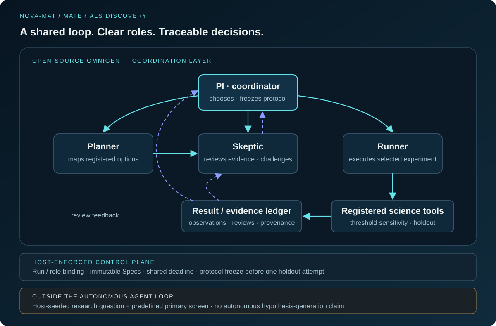

# NOVA-MAT

**From a materials-screening result to a controlled next experiment.**

NOVA-MAT is a 24-hour hackathon prototype built with **open-source Omnigent**.
Its agents propose registered tests, challenge sparse evidence, select and
execute a follow-up, and freeze a protocol before one controlled holdout.
Every decision links back to stored evidence.

[Evidence dashboard](https://nova-mat-scientific-demo.hy75252882.chatgpt.site/) ·
[Completed native run](docs/results/native09_completed/README.md) ·
[Independent scientific acceptance](docs/results/native09_science_acceptance/README.md) ·
[Video materials](docs/demo/README.md)

The dashboard is a **read-only replay of a completed real run**, not a live
model backend. Synthetic fixture demonstrations are separate from scientific evidence.

## Why it matters

A positive screen is not automatically a reliable discovery. NOVA-MAT makes
the next scientific decision inspectable: which alternatives were offered,
what the reviewer challenged, what was selected, and whether frozen validation
supports the claim. Its contribution is an evidence-bound decision loop and a
controlled stopping boundary—not a claim to have discovered new materials.

In native09, the Skeptic flagged sparse passing counts and uncertain effect
magnitude. PI selected threshold sensitivity from threshold, method and stop
options. Runner executed the registered follow-up; final review and protocol
freeze preceded one holdout. The workflow retained an **inconclusive**
validation rather than turning a positive estimate into confirmed discovery.

## Multi-agent architecture



This logical view matches the demo. Native09 used three native CLI sessions
sharing one parent deadline: discovery/follow-up, final review/freeze and
dedicated holdout execution—not one continuous model conversation.

| Component | Responsibility |
| --- | --- |
| PI | Coordinate specialists, commit a registered choice, freeze the protocol |
| Planner | Present feasible registered experiments and stopping options |
| Skeptic | Review evidence, cite weaknesses, challenge conclusions |
| Runner | Execute the selected registered experiment and return its Result |
| Host / registry / SQLite | Enforce roles, run binding, immutable Specs, stage gates, budget and attempts |
| Scientific tools | Compute screening, sensitivity and frozen holdout under Team A's fixed protocol |
| Dashboard | Replay recorded decisions, intervals and provenance |

The initial question and primary family screen are **host-seeded**; autonomous
hypothesis generation is not demonstrated. Models remain configurable. Luna
was used for low-cost rehearsal, not imposed as the final architecture.
The verified integration uses Omnigent 0.16.0 with its Codex harness,
**not Databricks**.

## What actually ran

Run `native-adaptive-live-09` completed with original launcher exit **0**:
**3 Results, 2 reviews, 1 frozen holdout**, 13 completed model turns and
8 guarded executor PIDs. These are workflow counts, not performance comparisons.

The frozen screen uses an inclusive OPT gap window of **1.1–1.8 eV** and primary
energy-above-hull threshold **≤0.05 eV/atom**, comparing oxide and
sulfide/selenide composition representatives in a frozen JARVIS-DFT snapshot.

| Primary endpoint | Oxide passes / observed | Chalcogenide passes / observed | Contrast¹ (percentage points) | 95% resampling interval (percentage points) |
| --- | ---: | ---: | ---: | --- |
| Discovery | 3 / 7,657 | 6 / 3,158 | +0.15081 | [0.01109, 0.32220] |
| Frozen holdout | 1 / 3,282 | 3 / 1,354 | +0.19110 | [-0.03047, 0.48652] |

¹ Chalcogenide pass rate minus oxide pass rate; percentage points, not percent improvement.

The holdout interval crosses zero: `direction_consistent_inconclusive`,
**not demonstrated replication**. Primary holdout field coverage is 100%
within the original OPT-selected cohort—not MBJ coverage or independent MBJ
validation. Discovery contrasts at 0.025 / 0.05 / 0.10 eV/atom are
+0.13221 / +0.15081 / +0.21415 percentage points. They reuse the same discovery
data and are not independent replications.

The separate [OPT/MBJ audit](docs/results/paired_method_audit/README.md) contains
13 paired shortlist disagreements and 6 missing comparators. It is exploratory,
human-selected work, **not the follow-up executed in native09**.

These are computational snapshot screening outcomes, not new materials,
synthesis, physical device performance or safety validation. No matched
latency/cost benchmark or **10× speedup** has been established.

## Try it without model calls

Start with the dashboard and recorded evidence above. For local integration
tests, use a dedicated environment:

```bash
python3 -m venv .venv-dev
.venv-dev/bin/python -m pip install -e '.[dev]'
.venv-dev/bin/python scripts/run_fixture_demo.py
.venv-dev/bin/python -m pytest
```

The fixture is synthetic and distinct from native09. Its numbers are not
scientific evidence. The completed run report records **426 passed** in its
offline regression: a run-specific check, not a claim that every platform or
future checkout has already passed. Native execution requires POSIX-compatible
permissions; see [Windows / WSL notes](docs/OMNIGENT_WINDOWS.md).

## Real native execution (opt-in)

Use Python 3.12, pinned scientific dependencies, Omnigent 0.16.0, your own
authenticated Codex CLI, the exact [prepared-data handoff](docs/A_DATA_HANDOFF.md)
and a compatible code-mode host configured through `CODEX_CODE_MODE_HOST_PATH`.
Data and credentials are not bundled in a clone. See the
[environment notes](docs/OPEN_SOURCE_OMNIGENT.md) and
[post-freeze handoff](docs/B_SUBMISSION_HANDOFF.md).

After provisioning that environment, check readiness and prepare a new run:

```bash
.venv-omnigent/bin/python scripts/check_prepared_data.py
.venv-omnigent/bin/python scripts/run_native_adaptive.py --check-only
.venv-omnigent/bin/python scripts/prepare_adaptive_run.py --database runs/my-new-discovery/run.sqlite --run-id my-new-discovery
.venv-omnigent/bin/python scripts/run_native_adaptive.py --enable-native-live --finalize-discovery --remaining-seconds 600
```

Choose an unused run ID/database. Deliberately finish or archive any existing
`.nova/live_context.json`; never overwrite it to replay a failed run. Preparation
executes the host-seeded primary screen. Live mode makes **paid model calls**
and may execute a registered follow-up. `--model` optionally overrides YAML.

This command does **not** request holdout execution. Separate opt-in
`--execute-frozen-holdout` requires live mode and finalization and is only
appropriate for an approved, fresh, supported frozen protocol. **Do not rerun
native09's holdout to improve its outcome or record a demo.** Portable evidence
is not runtime authorization.

## Safety and auditability

- Specialist function tools expose no arbitrary shell or arbitrary-path operation.
- Runner executes registered IDs; the host validates role, run and stage bindings.
- Freeze precedes holdout access; failures remain recorded rather than silently relabelled.
- `live`, `fixture` and `replay` remain distinct; missing values remain unknown.
- Credentials, raw/prepared data, live context, private PI text and live SQLite stay out of Git.
- Portable hashes establish artifact consistency, not independent provider identity or OS confinement.

See [security review](docs/B_SECURITY_REVIEW.md) and
[holdout interface](docs/HOLDOUT_VALIDATION.md) for implementation details.

## Evidence and project map

| Entry | What to inspect |
| --- | --- |
| [Native09 package](docs/results/native09_completed/) | Specs, Results, reviews, protocol, events, model/tool audit and hashes |
| [A's acceptance](docs/results/native09_science_acceptance/README.md) | Independently checked arithmetic, frozen gates, provenance and interpretation |
| [Video recipes](docs/demo/README.md) | Presentation materials; final MP4 upload is separate from repository publication |
| [Technical plan](NOVA-MAT_Technical_Plan.md) | Original scope and A/B ownership; planned features are not all completed claims |
| [Team status](docs/TEAM_STATUS.md) | Milestone history and verification boundaries |
| [Baseline protocol](docs/BASELINE_COMPARISON_PLAN.md) | Proposed matched comparison; measurement remains pending |

Historical run reports and failures remain under `docs/results/`. Their
“holdout unexecuted” statements apply to those runs, not native09. Team A owns
data, experiments and scientific interpretation; Team B owns orchestration,
shared contracts, storage, evidence display and packaging.

Data: NIST JARVIS-DFT / Kamal Choudhary and contributors. See
[data attribution and frozen-source details](docs/A_SCIENCE_ENGINE.md#data-attribution).
