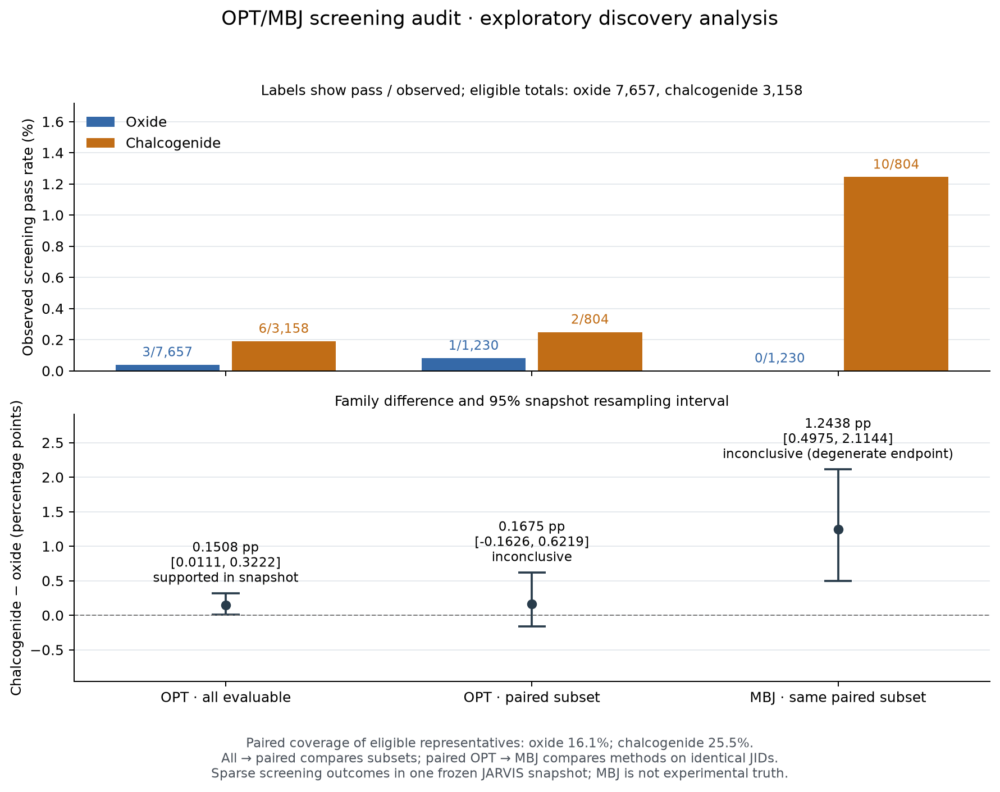

# Paired OPT/MBJ screening audit — recorded evidence

The 19-row [candidate evidence list](candidates.csv) has **no observed candidate passing both methods**: 3 pass OPT only, 10 pass MBJ only, and 6 pass OPT with MBJ unavailable. The 13 candidates with paired data have discordant screening decisions. The other 6 have an unknown comparator, not an MBJ failure. This is a useful method-dependence audit, not a claim that either method is ground truth.

The original 9 OPT candidates, counts and resampling interval reproduce exactly. No original result, representative, split, window or threshold was replaced. This is an exploratory extension, selected by the user after earlier discovery results. The [new protocol](../../METHOD_AUDIT_PROTOCOL.json) was registered and pushed at `647816f` before these new outcomes. The computation source was committed at `5d3bd35` and is identified by byte hashes in the result.

## Three registered arms

| Arm | Oxide passes / observed | Chalcogenide passes / observed | Chalcogenide minus oxide (percentage points) | 95% resampling interval (percentage points) | Frozen status |
|---|---:|---:|---:|---|---|
| OPT, all evaluable | 3 / 7,657 | 6 / 3,158 | 0.15081 | [0.01109, 0.32220] | supported_in_snapshot |
| OPT, paired subset | 1 / 1,230 | 2 / 804 | 0.16746 | [-0.16260, 0.62189] | inconclusive |
| MBJ, same paired subset | 0 / 1,230 | 10 / 804 | 1.24378 | [0.49751, 2.11443] | inconclusive |

The paired subset covers **16.06% of eligible oxides and 25.46% of eligible chalcogenides**. The comparison between all OPT and paired OPT measures a descriptive subset-selection difference. Changing from paired OPT to paired MBJ compares methods on identical representative JIDs. These are separate contrasts; neither is a causal or population claim.

The MBJ family interval is positive, but its oxide endpoint has zero passes and is degenerate. The preregistered rule therefore returns `inconclusive`. Do not override that status with a significance claim based only on this interval. The primary OPT status is preserved as an earlier snapshot-specific result; the two paired arms do not establish cross-method confirmation.

## Paired changes and candidate actions

Switching OPT to MBJ loses 1 oxide candidate and gains 0; it loses 2 chalcogenide candidates and gains 10. The within-family changes are -0.08130 and +0.99502 percentage points, respectively. Their chalcogenide-minus-oxide contrast is +1.07633 percentage points, with a joint-pair resampling interval [0.24876, 1.98532]. The extension classifies this **method-sensitivity contrast** as `direction_positive`; it is a different estimand from the family-screen hypothesis and is not a replication claim.

| Candidate evidence category | Count | Next useful check |
|---|---:|---|
| Both methods pass | 0 | No cross-method agreement candidate is established here. |
| OPT passes, MBJ fails | 3 | Recheck the same JID's calculation method, convergence and structural inputs. |
| MBJ passes, OPT fails | 10 | Recheck the same JID's calculation method, convergence and structural inputs. |
| OPT passes, MBJ unknown | 6 | Obtain the missing MBJ calculation before making a cross-method claim. |

For example, `JVASP-50168` (KRbO) has OPT 1.794 eV and MBJ 4.156 eV, while `JVASP-107267` (Zn2TeSe) has OPT 0.385 eV and MBJ 1.684 eV. These examples illustrate opposite changes in membership under the same 1.1–1.8 eV window; they are not a performance ranking. Every shortlisted row includes both available gaps, the frozen hull value, screening reason and a next validation action.

## Files and verification

- [Aggregate JSON](result.json), [candidate CSV](candidates.csv), [full Markdown report](report.md), and [self-contained HTML report](report.html).
- [Independent arithmetic verification](independent_verification.json) checks all 10,815 discovery audit rows, shortlist membership, counts, coverage, transitions, subset shifts and exact original-OPT agreement without importing the new scientific analysis helpers.
- [Raw-source and paired-bootstrap verification](raw_and_bootstrap_verification.json) matches all 19 candidate JIDs' gap/hull values to the original source and independently reproduces the joint-pair resampling intervals. Source properties are examined only for those eligible discovery JIDs.
- [Validation scope](validation.json) and [published checksums](published_checksums.json). The full `audit_rows.csv` remains in the ignored local run directory; its checksum is recorded without committing those 10,815 rows. The published package contains derived candidate evidence and aggregates, not the raw/prepared dataset or live database.

The updated combined Linux suite passes **217 tests**, including 14 new science and 7 new report cases, after synchronizing main `7796f6b` (PR #9). The isolated test checkout contains no prepared dataset or private live context. The real audit ran on Windows, Python 3.14.5 / NumPy 2.5.3; metadata/input validation plus computation took **0.9493 seconds**, of which computation was **0.4385 seconds**. That timing excludes startup, reporting, plotting, data preparation and human/model deliberation; it is not an acceleration benchmark.

The PNG was visually inspected. HTML export, escaping, unknown-value preservation and filtering controls are covered by static/export checks; browser rendering and actual filter interaction were not verified because the installed Tabbit launcher returned exit 1 without diagnostics. No browser success is claimed.

## Next team integration

B can wrap the standalone `nova.experiments.method_sensitivity.run_experiment()` in the registered-ID host only after adding explicit contract, provenance and authorization support. The existing live registry/YAML workflow does not yet expose this method audit as a real alternative. Preserve the old runs and frozen holdout protocol; this extension does not silently alter them.

For the next bounded live demonstration, record feasible alternatives and a genuine choose/stop decision, including why the method discrepancy or missing evidence changes the next action. Compare decision/report usefulness with a transparent rule and the cheap run-all-diagnostics baseline, including complete model latency/cost. Do not claim autonomous adaptation, speedup, new DFT, synthesizability, or a first-of-kind materials discovery from this standalone audit.

Reproduction commands and prior-work limits are in [the audit guide](../../METHOD_AUDIT.md). Holdout outcomes remain unexamined in this work.
